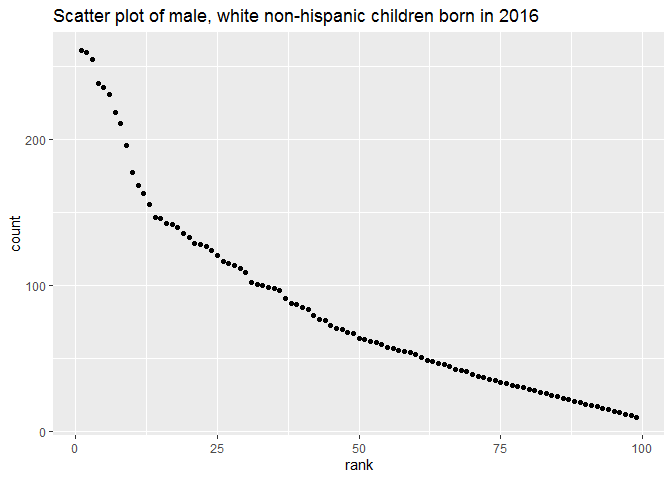

Homework 2\_Data Wrangling\_jm4998
================
Junhui Mi
2019/9/28

# Problem 1

*Read data from Excel and clean
Mr\_data*

``` r
Mr_data = read_excel("../dataset/HealthyHarborWaterWheelTotals2018-7-28.xlsx",
                     sheet = 1, range = "A2:N336") %>%
  janitor::clean_names() %>%
  drop_na(dumpster) %>%
  mutate(sports_balls = as.integer(sports_balls))
```

*Join 2017 and 2018 precipitation
data*

``` r
prec_2018 = read_excel("../dataset/HealthyHarborWaterWheelTotals2018-7-28.xlsx",
                     sheet = 3, range = "A2:B14") %>%
  janitor::clean_names() %>%
  mutate(year = rep(2018, 12), month = month.name[as.integer(month)]) %>%
  drop_na(total) 

prec_2017 = read_excel("../dataset/HealthyHarborWaterWheelTotals2018-7-28.xlsx",
                     sheet = 4, range = "A2:B14") %>%
  janitor::clean_names() %>%
  mutate(year = rep(2017, 12), month = month.name[as.integer(month)]) %>%
  drop_na(total)

prec_all = full_join(prec_2018, prec_2017)
```

    ## Joining, by = c("month", "total", "year")

## Description

1)  “Mr\_data” shows Mr. Trash Wheel data, with 285 observations. There
    are 14 variables: dumpster, month, year, date, weight\_tons,
    volume\_cubic\_yards, plastic\_bottles, polystyrene,
    cigarette\_butts, glass\_bottles, grocery\_bags, chip\_bags,
    sports\_balls, homes\_powered; “dumpster” and “sports\_balls” are
    key variables.

2)  “prec\_all” shows the combination of 2017 precipitation and 2018
    precipitation data, with 19. observations. There are 3 key
    variables: month, total, year.

3)  The the total precipitation in 2018 is 23.5.

4)  The median number of sports balls in a dumpster in 2017 is 8.

# Problem 2

*Read and clean pols\_month, unemployment and snp data from
csv*

``` r
pols_month = read_csv(file = "../dataset/fivethirtyeight_datasets/pols-month.csv") %>%
  janitor::clean_names() %>%
  separate(mon, c("year", "month", "day"), sep = "-") %>%
  mutate(month = month.name[as.integer(month)]) %>%
  pivot_longer(
    cols = starts_with("prez"),
    names_to = "president",
    values_to = "value") %>% 
  filter(value == 1 | value == 2) %>% 
  select(-day, -value) %>%
  mutate(
    president = replace(president, president == "prez_gop", "republican"),
    president = replace(president, president == "prez_dem", "democrat"))
```

    ## Parsed with column specification:
    ## cols(
    ##   mon = col_date(format = ""),
    ##   prez_gop = col_double(),
    ##   gov_gop = col_double(),
    ##   sen_gop = col_double(),
    ##   rep_gop = col_double(),
    ##   prez_dem = col_double(),
    ##   gov_dem = col_double(),
    ##   sen_dem = col_double(),
    ##   rep_dem = col_double()
    ## )

``` r
unemployment = read_csv(file = "../dataset/fivethirtyeight_datasets/unemployment.csv") %>%
  janitor::clean_names() %>%
  rename(January = jan, February = feb, March = mar, April = apr,
         May = may, June = jun, July = jul, August = aug,
         September = sep, October = oct, November = nov, December = dec) %>%
  pivot_longer(
    cols = January:December,
    names_to = "month",
    values_to = "unemployment_rate") %>%
  select(year, month, everything())
```

    ## Parsed with column specification:
    ## cols(
    ##   Year = col_double(),
    ##   Jan = col_double(),
    ##   Feb = col_double(),
    ##   Mar = col_double(),
    ##   Apr = col_double(),
    ##   May = col_double(),
    ##   Jun = col_double(),
    ##   Jul = col_double(),
    ##   Aug = col_double(),
    ##   Sep = col_double(),
    ##   Oct = col_double(),
    ##   Nov = col_double(),
    ##   Dec = col_double()
    ## )

``` r
snp = read_csv(file = "../dataset/fivethirtyeight_datasets/snp.csv") %>%
  janitor::clean_names() %>%
  separate(date, c("month", "day", "year"), sep = "/") %>%
  mutate(month = month.name[as.integer(month)]) %>%
  select(year, month, close)
```

    ## Parsed with column specification:
    ## cols(
    ##   date = col_character(),
    ##   close = col_double()
    ## )

*Left join three datasets by date*

``` r
pols_month_2 = pols_month %>%
  mutate(date = paste(year, month, sep = "-")) %>%
  select(date, gov_gop:president)

unemployment_2 = unemployment %>%
  mutate(date = paste(year, month, sep = "-")) %>%
  select(date, unemployment_rate)

snp_2 = snp %>%
  mutate(date = paste(year, month, sep = "-")) %>%
  select(date, close)

pols_snp = left_join(pols_month_2, snp_2, by = "date")
pols_snp_unemployment = left_join(pols_snp, unemployment_2, by = "date") %>%
  separate(date, c("year", "month"), sep = "-")
```

## Description

1)  The three initial datasets: “pols\_month” contains 822 observations
    of 9 variables related to the number of national politicians who are
    democratic or republican at any given time; “unemployment” contains
    68 observations of 13 variables related to unemployment rate; “snp”
    contains 787 observations of 2 variables related to Standard &
    Poor’s stock market index (S\&P), often used as a representative
    measure of stock market as a whole.

2)  The resulting dataset “pols\_snp\_unemployment” merges data from
    “pols\_month”, “unemployment” and “snp”, with 822 rows and 11
    columns. It contains data from year 1947 to 2015.Its variables are:
    year, month, gov\_gop, sen\_gop, rep\_gop, gov\_dem, sen\_dem,
    rep\_dem, president, close, unemployment\_rate. “year” and “month”
    are key variables which merge into “date” to be more accurate.

# Problem 3

*Read and clean baby names from csv*

``` r
baby_names = read_csv(file = "../dataset/Popular_Baby_Names.csv") %>%
  janitor::clean_names() %>%
  mutate(childs_first_name = str_to_title(childs_first_name),
         ethnicity = recode(ethnicity, 
                            "ASIAN AND PACI" = "ASIAN AND PACIFIC ISLANDER",
                            "BLACK NON HISP" = "BLACK NON HISPANIC",
                            "WHITE NON HISP" = "WHITE NON HISPANIC")) %>%
  distinct() 
```

    ## Parsed with column specification:
    ## cols(
    ##   `Year of Birth` = col_double(),
    ##   Gender = col_character(),
    ##   Ethnicity = col_character(),
    ##   `Child's First Name` = col_character(),
    ##   Count = col_double(),
    ##   Rank = col_double()
    ## )

The “baby\_names” dataset collects 12181 popular baby name samples from
year 2011 to 2016.

*Popularity of the name “Olivia”*

``` r
baby_names_olivia = baby_names %>%
  filter(childs_first_name == "Olivia", gender == "FEMALE") %>%
  select(year_of_birth, ethnicity, rank) %>%
  pivot_wider(
    names_from = "year_of_birth",
    values_from = "rank") %>%
  knitr::kable(format = "html")
baby_names_olivia
```

<table>

<thead>

<tr>

<th style="text-align:left;">

ethnicity

</th>

<th style="text-align:right;">

2016

</th>

<th style="text-align:right;">

2015

</th>

<th style="text-align:right;">

2014

</th>

<th style="text-align:right;">

2013

</th>

<th style="text-align:right;">

2012

</th>

<th style="text-align:right;">

2011

</th>

</tr>

</thead>

<tbody>

<tr>

<td style="text-align:left;">

ASIAN AND PACIFIC ISLANDER

</td>

<td style="text-align:right;">

1

</td>

<td style="text-align:right;">

1

</td>

<td style="text-align:right;">

1

</td>

<td style="text-align:right;">

3

</td>

<td style="text-align:right;">

3

</td>

<td style="text-align:right;">

4

</td>

</tr>

<tr>

<td style="text-align:left;">

BLACK NON HISPANIC

</td>

<td style="text-align:right;">

8

</td>

<td style="text-align:right;">

4

</td>

<td style="text-align:right;">

8

</td>

<td style="text-align:right;">

6

</td>

<td style="text-align:right;">

8

</td>

<td style="text-align:right;">

10

</td>

</tr>

<tr>

<td style="text-align:left;">

HISPANIC

</td>

<td style="text-align:right;">

13

</td>

<td style="text-align:right;">

16

</td>

<td style="text-align:right;">

16

</td>

<td style="text-align:right;">

22

</td>

<td style="text-align:right;">

22

</td>

<td style="text-align:right;">

18

</td>

</tr>

<tr>

<td style="text-align:left;">

WHITE NON HISPANIC

</td>

<td style="text-align:right;">

1

</td>

<td style="text-align:right;">

1

</td>

<td style="text-align:right;">

1

</td>

<td style="text-align:right;">

1

</td>

<td style="text-align:right;">

4

</td>

<td style="text-align:right;">

2

</td>

</tr>

</tbody>

</table>

The tibble “baby\_names\_olivia” above shows the rank in popularity of
the name “Olivia” as a female baby name over time.

*The most popular male name*

``` r
popular_male_names = baby_names %>%
  filter(gender == "MALE", rank == "1") %>%
  select(year_of_birth, ethnicity, childs_first_name) %>%
  pivot_wider(
    names_from = "year_of_birth",
    values_from = "childs_first_name") %>%
  knitr::kable(format = "html")
popular_male_names
```

<table>

<thead>

<tr>

<th style="text-align:left;">

ethnicity

</th>

<th style="text-align:left;">

2016

</th>

<th style="text-align:left;">

2015

</th>

<th style="text-align:left;">

2014

</th>

<th style="text-align:left;">

2013

</th>

<th style="text-align:left;">

2012

</th>

<th style="text-align:left;">

2011

</th>

</tr>

</thead>

<tbody>

<tr>

<td style="text-align:left;">

ASIAN AND PACIFIC ISLANDER

</td>

<td style="text-align:left;">

Ethan

</td>

<td style="text-align:left;">

Jayden

</td>

<td style="text-align:left;">

Jayden

</td>

<td style="text-align:left;">

Jayden

</td>

<td style="text-align:left;">

Ryan

</td>

<td style="text-align:left;">

Ethan

</td>

</tr>

<tr>

<td style="text-align:left;">

BLACK NON HISPANIC

</td>

<td style="text-align:left;">

Noah

</td>

<td style="text-align:left;">

Noah

</td>

<td style="text-align:left;">

Ethan

</td>

<td style="text-align:left;">

Ethan

</td>

<td style="text-align:left;">

Jayden

</td>

<td style="text-align:left;">

Jayden

</td>

</tr>

<tr>

<td style="text-align:left;">

HISPANIC

</td>

<td style="text-align:left;">

Liam

</td>

<td style="text-align:left;">

Liam

</td>

<td style="text-align:left;">

Liam

</td>

<td style="text-align:left;">

Jayden

</td>

<td style="text-align:left;">

Jayden

</td>

<td style="text-align:left;">

Jayden

</td>

</tr>

<tr>

<td style="text-align:left;">

WHITE NON HISPANIC

</td>

<td style="text-align:left;">

Joseph

</td>

<td style="text-align:left;">

David

</td>

<td style="text-align:left;">

Joseph

</td>

<td style="text-align:left;">

David

</td>

<td style="text-align:left;">

Joseph

</td>

<td style="text-align:left;">

Michael

</td>

</tr>

</tbody>

</table>

The tibble “popular\_male\_names” above shows the most popular name
among male children over time.

*Scatter plot of the popularity of names for male, white non-hispanic
children born in 2016*

``` r
plot_data = baby_names %>%
  filter(gender == "MALE", ethnicity == "WHITE NON HISPANIC", 
         year_of_birth == "2016")
ggplot(plot_data, aes(x = rank, y = count)) + 
  geom_point() +
  ggtitle("Scatter plot of male, white non-hispanic children born in 2016")
```

<!-- -->

``` r
ggsave("Scatter plot of male, white non-hispanic children born in 2016.png")
```

    ## Saving 7 x 5 in image

The scatter plot above shows the number of children with a name (y axis)
against the rank in popularity of that name (x axis) for male, white
non-hispanic children born in 2016.
